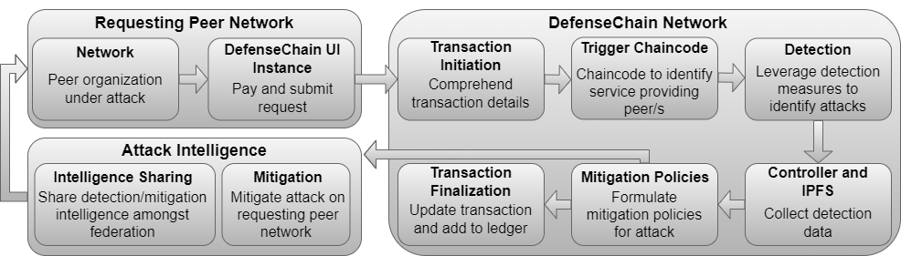
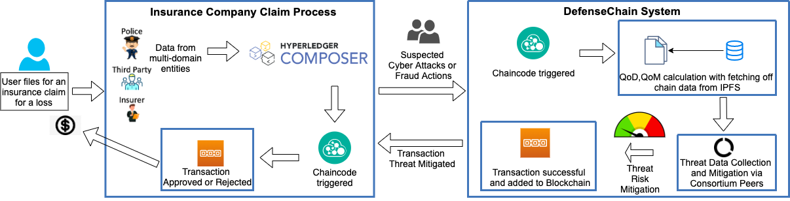
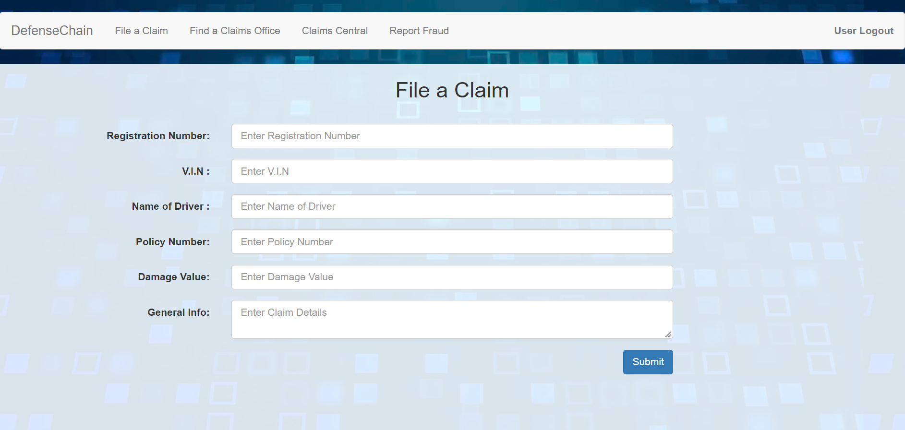
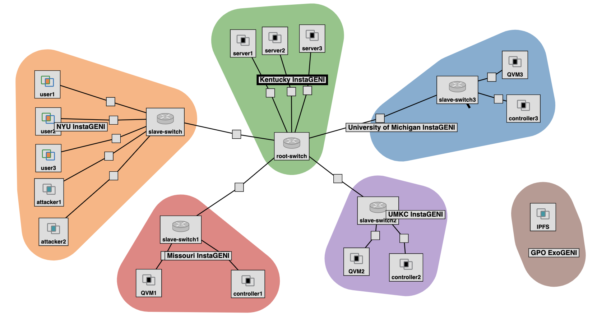

# Table of Contents 
* [DefenseChain](https://github.com/rneupane93/DefenseChain/blob/main/README.md#)  
* [DefenseChain Design](https://github.com/rneupane93/DefenseChain/blob/main/README.md##ontimeurb)
  * [DefenseChain Components](https://github.com/rneupane93/DefenseChain/blob/main/README.md#optimizer-engine)  
    * [Use Case](https://github.com/rneupane93/DefenseChain/blob/main/README.md#)
    * [User Interface](https://github.com/rneupane93/DefenseChain/blob/main/README.md#)
  * [Blockchain Components](https://github.com/rneupane93/DefenseChain/blob/main/README.md#)  
  * [Machine Learning Component](https://github.com/rneupane93/DefenseChain/blob/main/README.md#machine-learning-model)
    * [Datasets](https://github.com/rneupane93/DefenseChain/blob/main/README.md#machine-learning-model)
* [Experimental Testbed](https://github.com/rneupane93/DefenseChain/blob/main/README.md#machine-learning-model)
 

# DefenseChain 
 DefenseChain is a Blockchain-based collaborative Intel Sharing system for applications pertaining to multi-domain entities. In this project, DefenseChain is used with an application use case of Insurance Claims Processing which enables a secure and trustable Blockchain for processing insurance claims. This system can also be used for other industries pertaining to multi-domain entities such as Healthcare, etc.


# DefenseChain Design
DefenseChain design includes a Blockchain network that is responsible for identifying the requests formed by requesting peers and assigning them to service providing peers. The network houses an IPFS for detection data collection. Controller is used to formulate mitigation policies identified which is shared with the requestor. The mitigation and detection intelligence on several attacks is shared amongst federation. The security aspect of DefenseChain is based on a Defense by Pretense system called [Dolus](./Dolus-DefenseChain/). Dolus uses the idea of using Quarantine Virtual Machines and Software-defined controllers to sufficiently detect and mitigate attacks before they reach the target. 



## DefenseChain Components
Various components of DefenseChain include:

1. [Dolus system](./Dolus-DefenseChain/)
2. [Hyperledger Blockchain network](./Hyperledger/)
3. User space (requesting and service providing peers.)
4. [User Interface](./Hyperledger/DefenseChainNetwork/)
 
The Dolus system is designed to perform mitigation techniques in the system. This interfaces a backend system that is built using Laravel.

Hyperledger network is built to depict inter- and intra-organizational network by making use of various Insurance Organization as participating peers.

The requesting and service providing peers communicate through the Blockchain network to engage in detection and mitigation for identified threats.

The user interface fronts a form that enables users to enter their claim details for processing.
### Insurance Claims Processing - a use case
Use case of insurance claims application is used that follows the design explained before. Users are able to file for insurance claims using a user interface explained later which communicates with the DefenseChain system in order to trigger claims related contracts such as approval and cancellation. 



 ### Claims App - User Interface
 The Insurance claims processing application fronts a Claim form through which the users enter their insurance claims. The application is built on the Hyperledger composer that sits on the fabric network. Any action on the UI leads to an API call to the network for creation and approval of claims. The data is monitored for detection of fraudulent activities and other attacks such as Cryptojacking. The information collected is subject to triggering of different chaincodes and finally to detect fraudulent claims and attacks leverating our Machine Learning Model.



The claimants use the form to enter important details relating to an accident or an incident leading to filing of an insurance claim. Some of the information include Vehicle Identification Number, Policy Number, Damage Value, etc. These details are used to issue a transaction in the network which also enables triggering of chaincodes to determine any fraudulent or attack activities.

 

## Blockchain Components
Our system is built using a Blockchain network created using [Hyperledger Fabric](./Hyperledger/) with a sample of three insurance organizations. The smart contracts and related source codes are built using GO programming language. The contracts include issuance of claims, their approval and also the option to cancel a certain policy. The telemetry of this Blockchain network is collected by using [Hyperledger Explorer](./Hyperledger/explorer/). The information collected from the explorer can be helpful in statistically evaluating the performance of the Blockchain network. The necessary tools for initiating the network is explained [here](./Hyperledger/README.md). 

To initialize the network, docker images to create the peers and databases (CouchDB) is required. The code is compiled using the GO programming language but also can be reconfigured to use other technologies such as javascript.

Install curl
```bash
$ sudo apt install curl
```
Install Docker and Docker-ce
```bash
$ sudo apt-get -y install docker-compose
$ sudo systemctl enable docker
```
Add your user to docker group:
```bash
$ sudo usermod -aG docker [YourUser]
$ newgrp docker
```
Install Fabrics Docker Images and binary/config files
*In / and /fabric-samples*:
```bash
$ curl -sSL https://bit.ly/2ysbOFE | bash -s -- -s
```
Install Go, ** do this if you would like to use Go
Download Go for Linux at https://golang.org/dl/

*In Download folder*:
```bash
$ tar -C /usr/local -xzf go1.17.1.linux-amd64.tar.gz
```
*Edit .bashrc in home directory and add lines*:
```
export GOPATH=$HOME/[YourPathToDefenseChain]
export GOROOT=/usr/local/go
export PATH=$PATH:$GOROOT/bin
```
*Write changes and restart startup file*:
```bash
$ source ~/.bashrc
```
Install nvm -> install nodejs, ** do this if you would like to use javascript
```
$ curl -o- https://raw.githubusercontent.com/nvm-sh/nvm/v0.38.0/install.sh | bash
$ sudo nvm install 14.13.1
$ sudo nvm use 14.13.1
```


## Machine Learning Model

The [machine learning model](./ML/source/) is introduced as the detection model that uses various attack related datasets to predict the occurrence of an attack in the system. The prime objective of the model is to predict the nature of an attack to prescribe suitable mitigation plan. We compare three different machine learning models namely the SVM, KNN and LR models to pick the model suitable for a certain type of attack.

### Datasets
Our dataset collection consists of openly available datasets that belong to various attacks. Currently, we have datasets that are related to attacks such as Cryptojacking, Injection, Network Intrusion, Phishing and Insurance Frauds. These datasets can be found [here](./Datasets/). All of the datasets are ran through SVM, KNN and LR models.

# Experimental Testbed
DefenseChain experiments were performed using an Open Cloud Infrastructure called GENI. We created a peer federation network where each peer organization is connected through a centralized root switch. Each peer organization has a dedicated controller to engage different detection and mitigation protocols. Different channels were introduced through concept of inter- and intra-organization and deployment in virtual machines. All these components are connected via a network switch that facilitates interactions between the federation of users. The testbed setup is depicted in the image below.



## Requirements

a) A network of 14 Linux based virtual machines with around 1 GB of memory and 10 GB of storage is preferred. The experiment can be downscaled or upscaled based on the need of the user.

b) These VMs are connected via different types of switches each for different server locations as depicted in the testbed set up.
