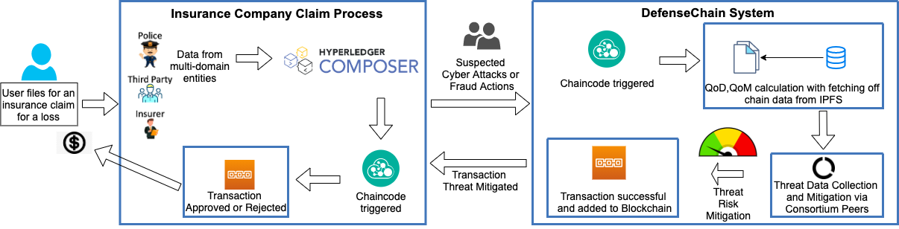

# Table of Contents 
* [DefenseChain](https://github.com/rneupane93/DefenseChain/blob/main/README.md#)  
* [DefenseChain Design](https://github.com/rneupane93/DefenseChain/blob/main/README.md##ontimeurb)
  * [DefenseChain Components](https://github.com/rneupane93/DefenseChain/blob/main/README.md#optimizer-engine)  
    * [Use Case](https://github.com/rneupane93/DefenseChain/blob/main/README.md#)
    * [User Interface](https://github.com/rneupane93/DefenseChain/blob/main/README.md#)
  * [Blockchain Components](https://github.com/rneupane93/DefenseChain/blob/main/README.md#)  
  * [Machine Learning Component](https://github.com/rneupane93/DefenseChain/blob/main/README.md#machine-learning-model)
* [Experimental Testbed](https://github.com/rneupane93/DefenseChain/blob/main/README.md#machine-learning-model)
 

# DefenseChain 
 DefenseChain is a Blockchain-based collaborative Intel Sharing system for applications pertaining to multi-domain entities. In this project, DefenseChain is used with an application use case of Insurance Claims Processing which enables a secure and trustable Blockchain for processing insurance claims. This system can also be used for other industries pertaining to multi-domain entities such as Healthcare, etc.
 

 <!-- ## Advantages
A large spectrum of reasearchers can use the software,   
1. 
2. It is ideal for researchers from small scale lab (sys admins etc) who do not have enough inhouse compute resources but wish to use public or community cloud resources optionally.  
3. Large scale cyber infrastucture engineers can leverage multiple clouds simulatneously to create large clusters of machine for analyzing big data (~100Gbs).
4. Optimal resource allocations/recommendations depending on user requirements of performance. agility, cost and security (PACS). 
5. Compatible with workflows created from Pegasus workflow managemnent system. -->
 

# DefenseChain Design
DefenseChain design includes a Blockchain network that is responsible for identifying the requests formed by requesting peers and assigning them to service providing peers. The network houses an IPFS for detection data collection. Controller is used to formulate mitigation policies identified which is shared with the requestor. The mitigation and detection intelligence on several attacks is shared amongst federation.

## Insurance Claims Processing - a use case
Use case of insurance claims application is used that follows the design explained before. Users are able to file for insurance claims using a user interface explained later which communicates with the DefenseChain system in order to trigger claims related contracts such as approval and cancellation. 

 ## Claims App - User Interface
 The Insurance claims processing application fronts a Claim form through which the users enter their insurance claims. The application is built on the Hyperledger composer that sits on the fabric network. Any action on the UI leads to an API call to the network for creation and approval of claims. The data is monitored for detection of fraudulent activities and other attacks such as Cryptojacking. The information collected is subject to triggering of different chaincodes and finally to detect fraudulent claims and attacks leverating our Machine Learning Model.

  
 
## Blockchain Components
Our system is built using a Blockchain network created using [Hyperledger Fabric](./Hyperledger/) with a sample of three insurance organizations. The smart contracts and related source codes are built using GO programming language. The contracts include issuance of claims, their approval and also the option to cancel a certain policy. The telemetry of this Blockchain network is collected by using [Hyperledger Explorer](./Hyperledger/explorer/). The information collected from the explorer can be helpful in statistically evaluating the performance of the Blockchain network. 

## Machine Learning Model

The [machine learning model](./Learning) is introduced as an aid to the optimizer engine to learn from previous application workflow executions and is implemented in java language. The prime objective of the model is to predict favorable cloud service platform (CSP) for executing certain application. The model tries to learn this from previous executions of the workflows and taking feedback from expert users for the corresponding cloud resource allocations. Since different users can have different priorities of CSPs for similar application workflows, this kind of learning should be classified based on probability, specifcally *naive bayes method* is implemented for classification. The probabilistic classification of selection of cloud platform can be used to bias the optimizer towards selecting specific platforms.

## 